## 👋 Hi there

Hi, I’m **Ümit** 👋  
I’m a **Full-Stack Developer** focused on building web applications with **React** & **Django**.

💻 JavaScript • React • Python • Django • PostgreSQL     
🚀 Focused on building scalable web apps and exploring new technologies.  
✨ A lifelong learner, motivated to grow and excel in the IT industry.  

🌱 Currently learning: Python, JavaScript, React, Django, WordPress, PostgreSQL, Git&GitHub, HTML, CSS, Sass, Bootstrap  
👯 Always open to collaboration on exciting Full-Stack projects  
📫 How to reach me:  

 

## 🌐 Connect with Me  

 

# 💻 Frontend  

## 🚀 Featured Frontend Projects  

<table>
  <!-- Row 1 -->
  <tr>
    <td width="50%">
      <h2>📌 React Contacts App (Firebase)</h2>
      
A modern contact management application built with React and Firebase,
  featuring authentication-based protected routes, full CRUD operations,
  and a clean Material UI interface.
      

      

        
        
        
        
        
      

      

        <a href="https://umitdev-firecontact.netlify.app/">🔗 Live Demo</a>
          &nbsp;&nbsp;&nbsp;&nbsp;
        <a href="https://github.com/Umit8098/React-Project-12-firecontact-app.git">📂 Repository<a>
      

      

        
      

    </td>
    <td width="50%">
      <h2>📰 React News App (Firebase & Netlify)</h2>
      
A modern React news application with Firebase authentication, protected routes,
  Redux Toolkit state management, and secure NewsAPI integration via Netlify Functions.

      

        
        
        
        
        
        
      

      

        <a href="https://news-v2-umitdev.netlify.app/">🔗 Live Demo</a>
          &nbsp;&nbsp;&nbsp;&nbsp;
        <a href="https://github.com/Umit8098/React-Project-11.3-news-API-netlify.git">📂 Repository</a>
      

      

        
      

    </td>
  </tr>
  <!-- Row 2 -->
  <tr>
    <td width="50%">
      <h2>📌 Recipe App – Multipage</h2>
      
A full recipe browsing UI with page transitions and style component architecture.

      

        
        
        
      

      

        <a href="https://recipe-app-umitdev.netlify.app/">🔗 Live Demo</a>
          &nbsp;&nbsp;&nbsp;&nbsp;
        <a href="https://github.com/Umit8098/React-Project-Recipe-App.git">📂 Repository</a>
      

      

        
      

    </td>
    <td width="50%">
      <h2>🎬 Movie App – Firebase Auth</h2>
      
A Firebase authentication + TMDB API powered movie browsing platform.

      

        
        
        
      

      

        <a href="https://firebase-movie-app-umitdev.netlify.app/">🔗 Live Demo</a>
          &nbsp;&nbsp;&nbsp;&nbsp;
        <a href="https://github.com/Umit8098/React-Project-Firebase-Movie-App.git">📂 Repository</a>
      

      

        
      

    </td>
  </tr>

  <!-- Row 2 -->
  <tr>
    <td width="50%">
      <h2>🎨 SASS Landing Page</h2>
      
A responsive landing page built using Sass with modern UI components.

      

        
        
        
      

      

        <a href="https://umit8098.github.io/Project-Website-HTML-CSS-SASS/">🔗 Live Demo</a>
          &nbsp;&nbsp;&nbsp;&nbsp;
        <a href="https://github.com/Umit8098/Project-Website-HTML-CSS-SASS.git">📂 Repository</a>
      

      

        
      

    </td>
    <td width="50%">
      <h2>🅱️ Bootstrap Single Page</h2>
      
A clean single-page bootstrap layout with responsive sections and components.

      

        
        
        
      

      

        <a href="https://umit8098.github.io/Project-Bootstrap-Single-Page-Website/">🔗 Live Demo</a>
          &nbsp;&nbsp;&nbsp;&nbsp;
        <a href="https://github.com/Umit8098/Project-Bootstrap-Single-Page-Website.git">📂 Repository</a>
      

      

        
      

    </td>
  </tr>

  <!-- Row 4 -->
  <tr>
    <td width="50%">
      <h2>🛒 Checkout/Shopping Card - Javascript</h2>
      
A dynamic shopping cart interface with persistent storage and price calculations.

      

        
        
      

      

        <a href="https://umit8098.github.io/Project-js-checkout-shopping_cart/">🔗 Live Demo</a>
          &nbsp;&nbsp;&nbsp;&nbsp;
        <a href="https://github.com/Umit8098/Project-js-checkout-shopping_cart.git">📂 Repository</a>
      

      

        
      

    </td>
    <td width="50%">
      <h2>✅ ToDo App</h2>
      
A simple yet robust task manager app with local persistence.

      

        
        
      

      

        <a href="https://umit8098.github.io/Project-js-ToDo-LocalStorage/">🔗 Live Demo</a>
          &nbsp;&nbsp;&nbsp;&nbsp;
        <a href="https://github.com/Umit8098/Project-js-ToDo-LocalStorage.git">📂 Repository</a>
      

      

        <a href="https://umit8098.github.io/Project-js-ToDo-LocalStorage/">
          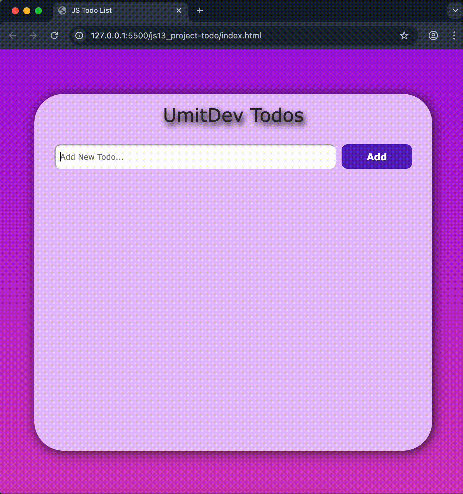
        </a>
      

    </td>
  </tr>

  <!-- Row 5 -->
  <tr>
    <td width="50%">
      <h2>📱 iOS Calculator</h2>
      
A pixel-perfect clone of the Apple iOS calculator UI & logic.

      

        
      

      

      <a href="https://umit8098.github.io/Project-js-IOS-Calculator/">🔗 Live Demo</a>
        &nbsp;&nbsp;&nbsp;&nbsp;
      <a href="https://github.com/Umit8098/Project-js-IOS-Calculator.git">📂 Repository</a>
      

      

        <a href="https://umit8098.github.io/Project-js-IOS-Calculator/">
          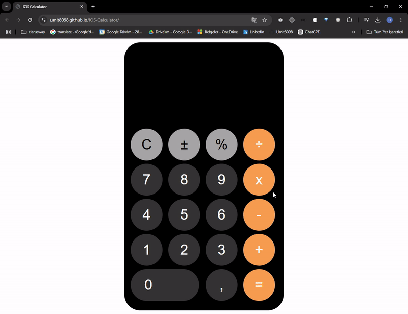
        </a>
      

    </td>
    <td width="50%">
      <h2>🚩 Flag App – REST API</h2>
      
Search and display country data through an external REST API.

      

        
        
      

      

        <a href="https://umit8098.github.io/Project-js-Flag-App/">🔗 Live Demo</a>
          &nbsp;&nbsp;&nbsp;&nbsp;
        <a href="https://github.com/Umit8098/Project-js-Flag-App.git">📂 Repository</a>
      

      

        
      

    </td>
  </tr>

  <!-- Row 6 -->
  <tr>
    <td width="50%">
      <h2>🗺️ Tour Places</h2>
      
A mini React gallery showcase with dynamic component rendering.

      

        
        
      

      

        <a href="https://umit8098.github.io/React_Proj_Tour_Places/">🔗 Live Demo</a>
          &nbsp;&nbsp;&nbsp;&nbsp;
        <a href="https://github.com/Umit8098/React_Proj_Tour_Places.git">📂 Repository</a>
      

      

        
      

    </td>
    <td width="50%">
      <h2>🗣️ Language Cards</h2>
      
A simple React UI showing reusable card components.

      

        
      

      

        <a href="https://umit8098.github.io/React-Project-Language-Cards/">🔗 Live Demo</a>
          &nbsp;&nbsp;&nbsp;&nbsp;
        <a href="https://github.com/Umit8098/React-Project-Language-Cards.git">📂 Repository</a>
      

      

        <a href="https://umit8098.github.io/React-Project-Language-Cards/">
          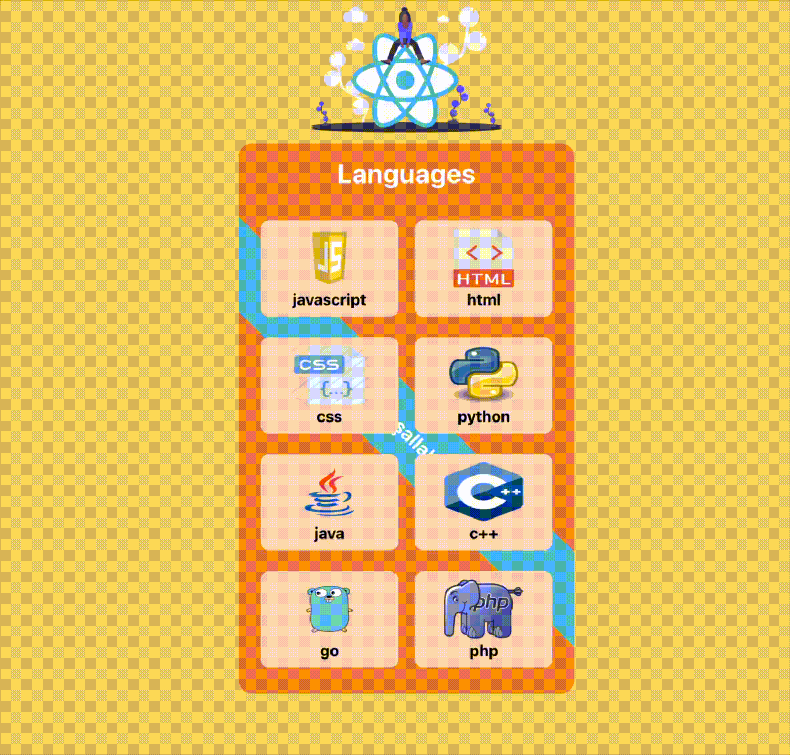
        </a>
      

    </td>
  </tr>

  <!-- Row 7 -->
  <tr>
    <td width="50%">
      <h2>📚 Tutorial FullStack (React + Django)</h2>
      
A full-stack educational CRUD project using Django REST + React UI.

      

        
        
      

      

        <a href="https://umit8098.github.io/React-Project-Tutorial-FullStack/">🔗 Live Demo</a>
          &nbsp;&nbsp;&nbsp;&nbsp;
        <a href="https://github.com/Umit8098/React-Project-Tutorial-FullStack.git">📂 Repository</a>
      

      

        <a href="https://umit8098.github.io/React-Project-Tutorial-FullStack/">
          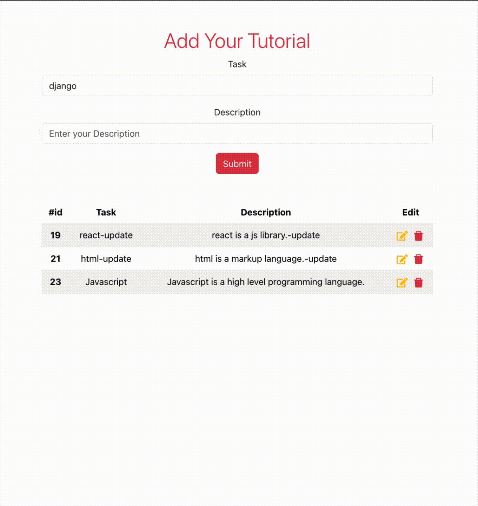
        </a>
      

    </td>
    <td width="50%">
      <h2>📋 Task Tracker</h2>
      
A React task manager with add/delete/toggle features and persistent storage.

      

        
        
      

      

        <a href="https://umit8098.github.io/React-Project-Task-Tracker-Single-Page/">🔗 Live Demo</a>
          &nbsp;&nbsp;&nbsp;&nbsp;
        <a href="https://github.com/Umit8098/React-Project-Task-Tracker-Single-Page.git">📂 Repository</a>
      

      

        
      

    </td>
  </tr>

  <!-- Row 8 -->
  <tr>
    <td width="50%">
      <h2>⚛️ Modern Multipage Website Layout</h2>
      
A modern multi-page React website with router-based navigation.

      

        
        
      

      

        <a href="https://umit8098.github.io/React-Project-Router/">🔗 Live Demo</a>
          &nbsp;&nbsp;&nbsp;&nbsp;
        <a href="https://github.com/Umit8098/React-Project-Router.git">📂 Repository</a>
      

      

        
      

    </td>
    <td width="50%">
      <h2>—</h2>
    </td>
  </tr>
</table>

 
 
 

# ⚙ Backend  

### 🚀 Featured Backend Projects  

 

<table>
  <!-- Row 1 -->
  <tr>
    <!-- Card 1 -->
    <td width="50%" valign="top">
      <h2>✈️ Flight Reservation REST API</h2>
      
A full-featured flight management API built with Django REST Framework.

      

        
        
      

      

        <a href="https://umit8113.pythonanywhere.com/">🔗 Live Demo</a>
          &nbsp;&nbsp;&nbsp;&nbsp;
        <a href="https://github.com/Umit8098/Project_Django_Rest_Framework_Flight_App_CH-12.git">📂 Repository</a>
      

      

        <a href="https://umit8113.pythonanywhere.com/">
          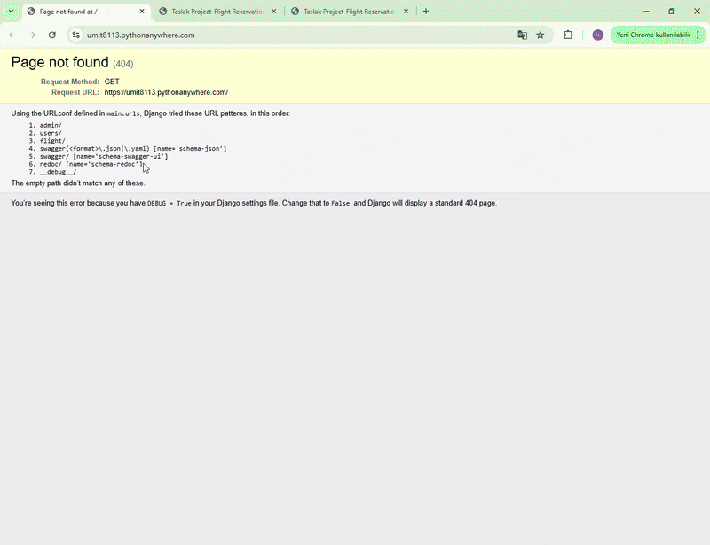
        </a>
      

    </td>
    <!-- Card 2 -->
    <td width="50%" valign="top">
      <h2>📝 Blog REST API</h2>
      
A RESTful blog backend with CRUD posts, categories, and authentication.

      

        
      

      

        <a href="https://umit8114.pythonanywhere.com/">🔗 Live Demo</a>
          &nbsp;&nbsp;&nbsp;&nbsp;
        <a href="https://github.com/Umit8098/Project_Django_Rest_Framework_Blog_App_CH-12_V.02.git">📂 Repository</a>
      

      

        <a href="https://umit8114.pythonanywhere.com/">
          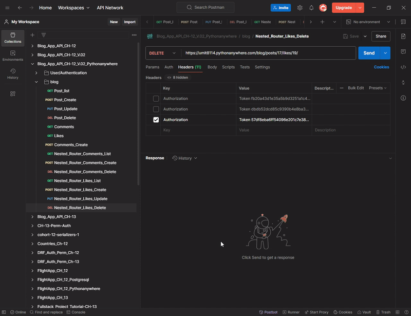
        </a>
      

    </td>
  </tr>

  <!-- Row 2 -->
  <tr>
    <!-- Card 1 -->
    <td width="50%" valign="top">
      <h2>👤 Personnel Management REST API</h2>
      
Personnel management API with filtering and authorization.

      

        
      

      

        <a href="https://umit8100.pythonanywhere.com/">🔗 Live Demo</a>
          &nbsp;&nbsp;&nbsp;&nbsp;
        <a href="https://github.com/Umit8098/Project_Django_Rest_Framawork_Personnel_App_CH-12.git">📂 Repository</a>
      

      

        
      

    </td>
    <!-- Card 2 -->
    <td width="50%" valign="top">
      <h2>✅ Todo REST API</h2>
      
Task management API with Swagger & Redoc documentation.

      

        
      

      

        <a href="https://umit8101.pythonanywhere.com/">🔗 Live Demo</a>
          &nbsp;&nbsp;&nbsp;&nbsp;
        <a href="https://github.com/Umit8098/Project_Django_Rest_Framework_Todo_App_CH-12.git">📂 Repository</a>
      

      

        <a href="https://umit8101.pythonanywhere.com/">
          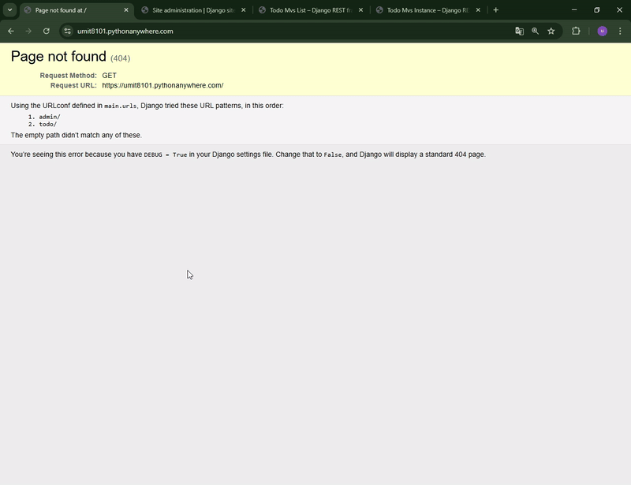
        </a>
      

    </td>
  </tr>

  <!-- Row 3 -->
  <tr>
    <td width="50%" valign="top">
      <h2>📝 Quiz REST API</h2>
      
Quiz system with categories, questions and scoring.

      

        
      

      

        <a href="https://umit8102.pythonanywhere.com/">🔗 Live Demo</a>
          &nbsp;&nbsp;&nbsp;&nbsp;
        <a href="https://github.com/Umit8098/Project_Django_Rest_Framework_Quiz_App_CH-11_V.01.git">📂 Repository</a>
      

      

        <a href="https://umit8102.pythonanywhere.com/">
          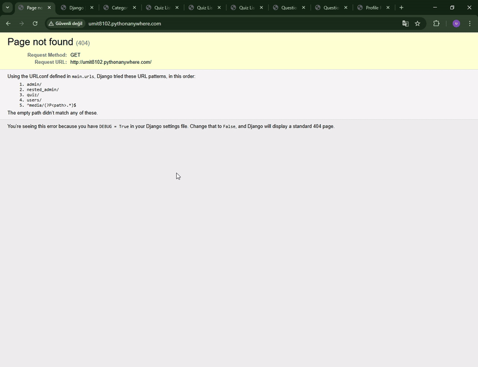
        </a>
      

    </td>
    <td width="50%" valign="top">
      <h2>📊 Stock API – REST API</h2>
      
Inventory management API with purchases & sales workflows.

      

        
      

      

        <a href="https://umit8103.pythonanywhere.com/">🔗 Live Demo</a>
          &nbsp;&nbsp;&nbsp;&nbsp;
        <a href="https://github.com/Umit8098/Project_Django_Rest_Framework_Stock_App_CH-13.git">📂 Repository</a>
      

      

        <a href="https://umit8103.pythonanywhere.com/">
          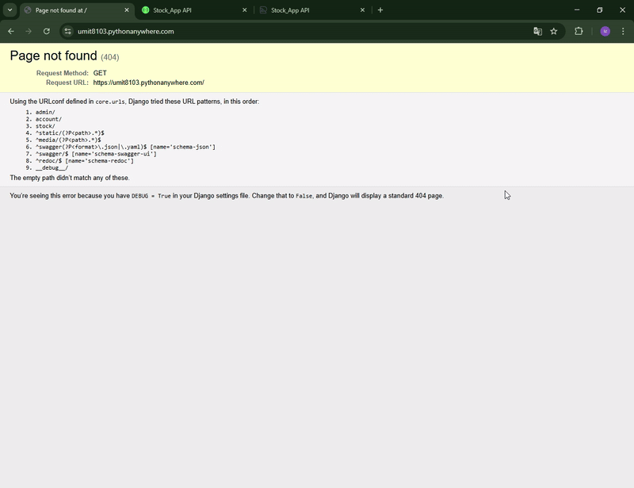
        </a>
      

    </td>
  </tr>

  <!-- Row 4 -->
  <tr>
    <td width="50%" valign="top">
      <h2>🚗 Rent A Car REST API</h2>
      
Car rental CRUD backend with reservation system.

      

        
      

      

        <a href="https://umit8104.pythonanywhere.com/">🔗 Live Demo</a>
          &nbsp;&nbsp;&nbsp;&nbsp;
        <a href="https://github.com/Umit8098/Project_Django_Rest_Framework_Rent_A_Car_App_CH-12.git">📂 Repository</a>
      

      

        <a href="https://umit8104.pythonanywhere.com/">
          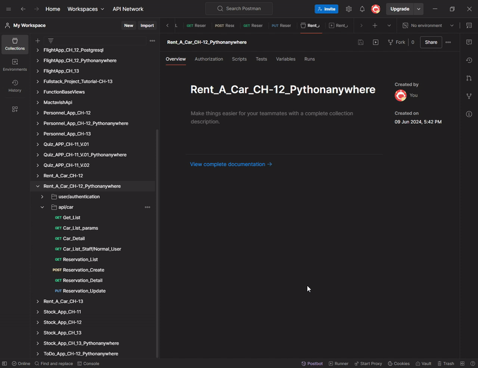
        </a>
      

    </td>
    <td width="50%" valign="top">
      <h2>🔐 Google Auth API – Allauth</h2>
      
Google OAuth2 login integrated with Django REST Framework.

      

        
        
      

      

        <a href="https://umit8110.pythonanywhere.com/">🔗 Live Demo</a>
          &nbsp;&nbsp;&nbsp;&nbsp;
        <a href="https://github.com/Umit8098/Proj_Auth_Dj_Allauth_Google_Official_doc_CH-11_V.02.git">📂 Repository</a>
      

      

        <a href="https://umit8110.pythonanywhere.com/">
          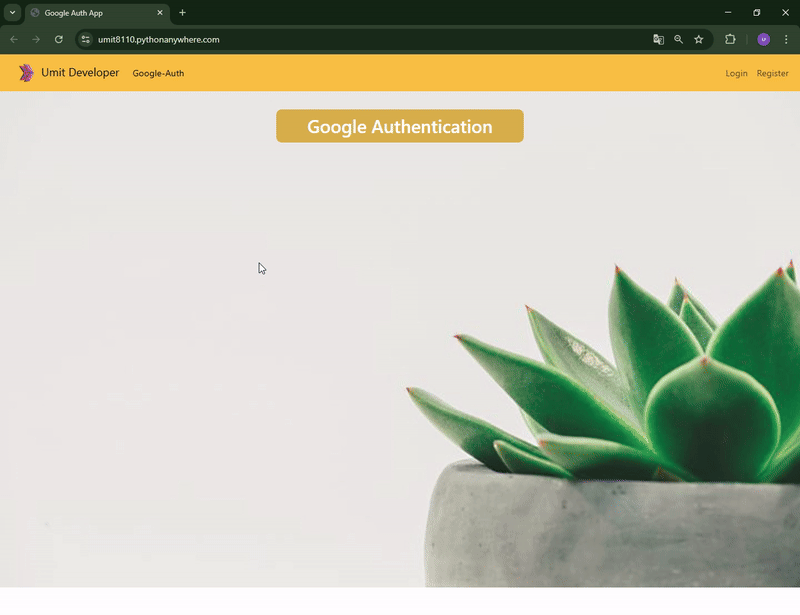
        </a>
      

    </td>
  </tr>

  <!-- Row 5 -->
  <tr>
    <td width="50%" valign="top">
      <h2>📝 Blog App – FullStack</h2>
      
Django REST + Templates blog system with CRUD UI.

      

        
      

      

        <a href="https://umit8112.pythonanywhere.com/">🔗 Live Demo</a>
          &nbsp;&nbsp;&nbsp;&nbsp;
        <a href="https://github.com/Umit8098/Proj_Django_Temp_Blog_App_CH-8.git">📂 Repository</a>
      

      

        <a href="https://umit8112.pythonanywhere.com/">
          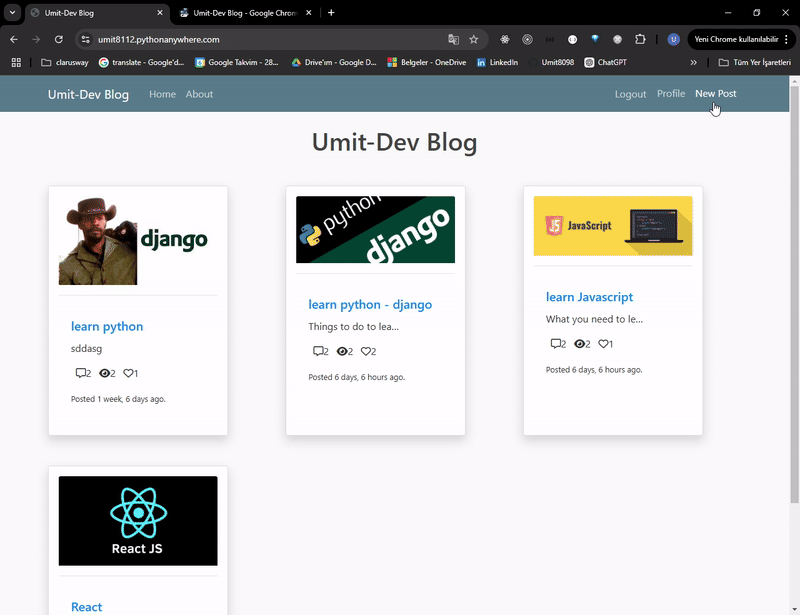
        </a>
      

    </td>
    <td width="50%" valign="top">
      <h2>✅ Todo App – FullStack</h2>
      
Template-based UI + REST backend task manager.

      

        
      

      

        <a href="https://umit8106.pythonanywhere.com/">🔗 Live Demo</a>
          &nbsp;&nbsp;&nbsp;&nbsp;
        <a href="https://github.com/Umit8098/Project_Django_Templates_Authantication-1_Todo_App_Class_Based_CH-11.git">📂 Repository</a>
      

      

        <a href="https://umit8106.pythonanywhere.com/">
          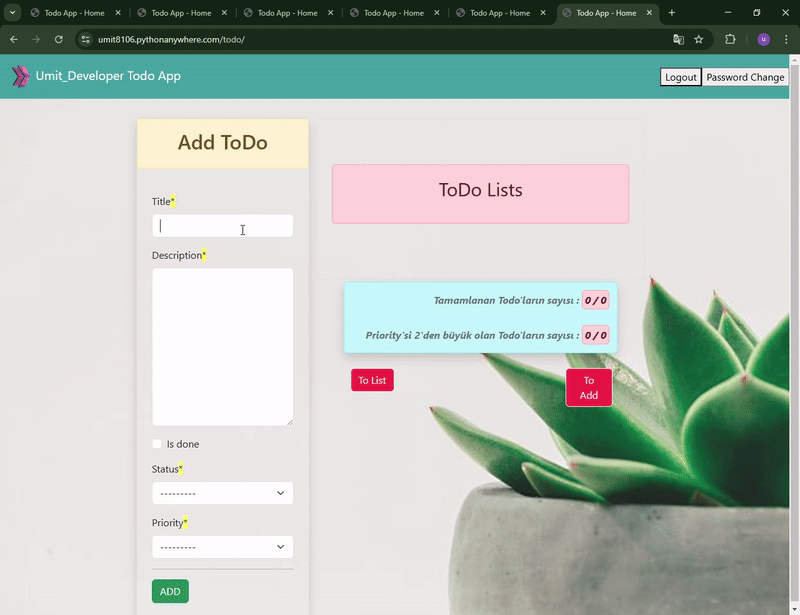
        </a>
      

    </td>
  </tr>

  <!-- Row 6 -->
  <tr>
    <td width="50%" valign="top">
      <h2>🌦️ Weather App – FullStack</h2>
      
Weather search UI consuming Django REST API.

      

        
      

      

        <a href="https://umit8108.pythonanywhere.com/">🔗 Live Demo</a>
          &nbsp;&nbsp;&nbsp;&nbsp;
        <a href="https://github.com/Umit8098/Proj_WeatherApp-API-_Temp_Auth-2_email_CH-11_V.04.git">📂 Repository</a>
      

      

        <a href="https://umit8108.pythonanywhere.com/">
          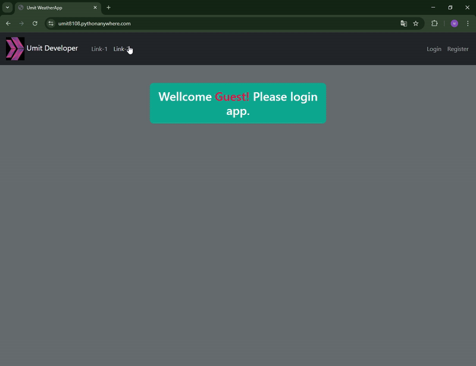
        </a>
      

    </td>
    <td width="50%" valign="top">
      <h2>🍕 Pizza App – FullStack</h2>
      
Pizza order UI backed by a Django REST API.

      

        
      

      

        <a href="https://umit8111.pythonanywhere.com/">🔗 Live Demo</a>
          &nbsp;&nbsp;&nbsp;&nbsp;
        <a href="https://github.com/Umit8098/Project_Django_Templates_Pizza_App_CH-12_V.03.git">📂 Repository</a>
      

      

        <a href="https://umit8111.pythonanywhere.com/">
          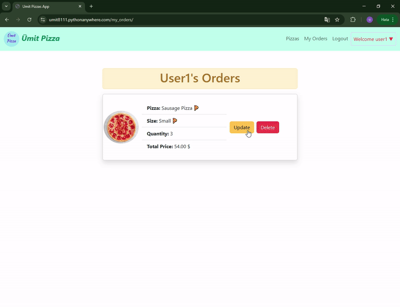
        </a>
      

    </td>
  </tr>
</table>

 

# 🛠 Tools  

 

## 📊 GitHub Stats  

&nbsp;

  

 

## 🐍 Snake Animation

