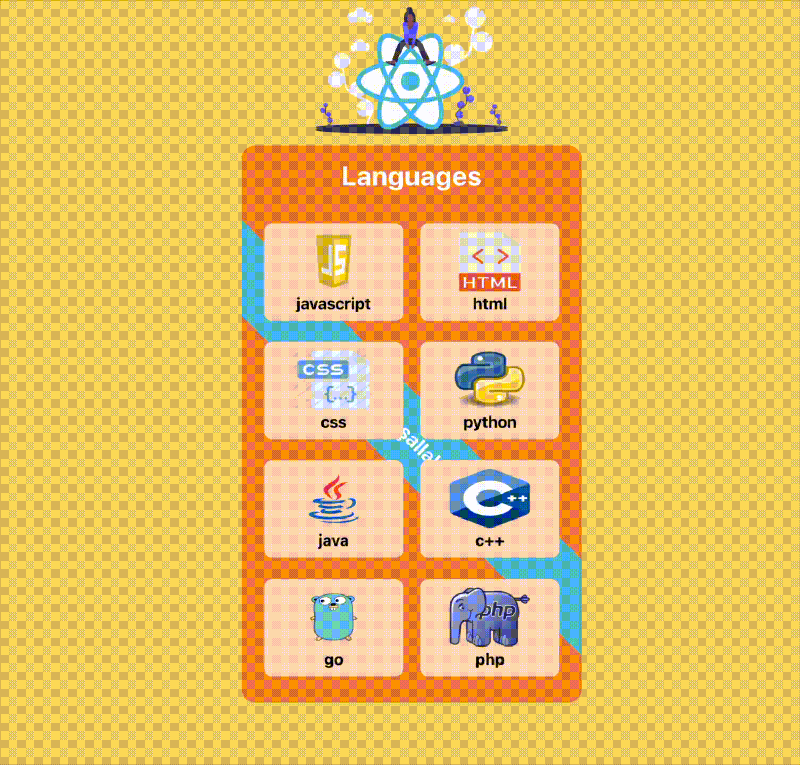

## 👋 Hi there

Hi, I’m **Ümit** 👋  
I’m a **Full-Stack Developer** focused on building web applications with **React** & **Django**.

💻 JavaScript • React • Python • Django • PostgreSQL     
🚀 Focused on building scalable web apps and exploring new technologies.  
✨ A lifelong learner, motivated to grow and excel in the IT industry.  

🌱 Currently learning: Python, JavaScript, React, Django, WordPress, PostgreSQL, Git&GitHub, HTML, CSS, Sass, Bootstrap  
👯 Always open to collaboration on exciting Full-Stack projects  
📫 How to reach me:  

 

## 🌐 Connect with Me  

 

# 💻 Frontend  

## 🚀 Featured Frontend Projects  

<table>
  <!-- Row 1 -->
  <tr>
    <td width="50%">
      <h2>📌 Recipe App – Multipage</h2>
      
A full recipe browsing UI with page transitions and style component architecture.

      

        
        
        
      

      <a href="https://recipe-app-umitdev.netlify.app/">🔗 Live Demo</a>
        
      
    </td>
    <td width="50%">
      <h2>🎬 Movie App – Firebase Auth</h2>
      
A Firebase authentication + TMDB API powered movie browsing platform.

      

        
        
        
      

      <a href="https://firebase-movie-app-umitdev.netlify.app/">🔗 Live Demo</a>
        
      
    </td>
  </tr>

  <!-- Row 2 -->
  <tr>
    <td width="50%">
      <h2>🎨 SASS Landing Page</h2>
      
A responsive landing page built using Sass with modern UI components.

      

        
        
        
      

      <a href="https://umit8098.github.io/Project-Website-HTML-CSS-SASS/">🔗 Live Demo</a>
        
      
    </td>
    <td width="50%">
      <h2>🅱️ Bootstrap Single Page</h2>
      
A clean single-page bootstrap layout with responsive sections and components.

      

        
        
        
      

      <a href="https://umit8098.github.io/Project-Bootstrap-Single-Page-Website/">🔗 Live Demo</a>
        
      
    </td>
  </tr>

  <!-- Row 3 -->
  <tr>
    <td width="50%">
      <h2>🛒 Checkout Card</h2>
      
A dynamic shopping cart interface with persistent storage and price calculations.

      

        
        
      

      <a href="https://umit8098.github.io/Project-js-checkout-shopping_cart/">🔗 Live Demo</a>
        
      
    </td>
    <td width="50%">
      <h2>✅ ToDo App</h2>
      
A simple yet robust task manager app with local persistence.

      

        
        
      

      <a href="https://umit8098.github.io/Project-js-ToDo-LocalStorage/">🔗 Live Demo</a>
        
      
    </td>
  </tr>

  <!-- Row 4 -->
  <tr>
    <td width="50%">
      <h2>📱 iOS Calculator</h2>
      
A pixel-perfect clone of the Apple iOS calculator UI & logic.

      

        
      

      <a href="https://umit8098.github.io/Project-js-IOS-Calculator/">🔗 Live Demo</a>
        
      
    </td>
    <td width="50%">
      <h2>🚩 Flag App – REST API</h2>
      
Search and display country data through an external REST API.

      

        
        
      

      <a href="https://umit8098.github.io/Project-js-Flag-App/">🔗 Live Demo</a>
        
      
    </td>
  </tr>

  <!-- Row 5 -->
  <tr>
    <td width="50%">
      <h2>🗺️ Tour Places</h2>
      
A mini React gallery showcase with dynamic component rendering.

      

        
        
      

      <a href="https://umit8098.github.io/React_Proj_Tour_Places/">🔗 Live Demo</a>
        
      
    </td>
    <td width="50%">
      <h2>🗣️ Language Cards</h2>
      
A simple React UI showing reusable card components.

      

        
      

      <a href="https://umit8098.github.io/React-Project-Language-Cards/">🔗 Live Demo</a>
        
      
    </td>
  </tr>

  <!-- Row 6 -->
  <tr>
    <td width="50%">
      <h2>📚 Tutorial FullStack (React + Django)</h2>
      
A full-stack educational CRUD project using Django REST + React UI.

      

        
        
      

      <a href="https://umit8098.github.io/React-Project-Tutorial-FullStack/">🔗 Live Demo</a>
        
      
    </td>
    <td width="50%">
      <h2>📋 Task Tracker</h2>
      
A React task manager with add/delete/toggle features and persistent storage.

      

        
        
      

      <a href="https://umit8098.github.io/React-Project-Task-Tracker-Single-Page/">🔗 Live Demo</a>
        
      
    </td>
  </tr>

  <!-- Row 7 -->
  <tr>
    <td width="50%">
      <h2>⚛️ Modern Multipage Website Layout</h2>
      
A modern multi-page React website with router-based navigation.

      

        
        
      

      <a href="https://umit8098.github.io/React-Project-Router/">🔗 Live Demo</a>
        
      
    </td>
    <td width="50%">
      <h2>—</h2>
    </td>
  </tr>
</table>

 

<table>
  <!-- Row 1 -->
  <tr>
    <td width="50%">
      <h2>📌 Recipe App – Multipage</h2>
      
A full recipe browsing UI with page transitions and style component architecture.

      

        
        
        
      

      <a href="https://recipe-app-umitdev.netlify.app/">🔗 Live Demo</a>
        
      
      <!-- Cover image -->
      
      <!-- GIF Preview -->
     
    
    
<strong>Tech:</strong> React · Router · Styled Components

      <!-- Buttons -->
    <a href="https://github.com/Umit8098/recipe-app" target="_blank">🔗 Repo</a> • 
    <a href="https://recipe-app-umitdev.netlify.app/" target="_blank">🚀 Live Demo</a>
    </td>
    <td width="50%">
      <h2>🎬 Movie App – Firebase Auth</h2>
      
A Firebase authentication + TMDB API powered movie browsing platform.

      

        
        
        
      

      <a href="https://firebase-movie-app-umitdev.netlify.app/">🔗 Live Demo</a>
        
      
    </td>
  </tr>

  <!-- Row 2 -->
  <tr>
    <td width="50%">
      <h2>🎨 SASS Landing Page</h2>
      
A responsive landing page built using Sass with modern UI components.

      

        
        
        
      

      <a href="https://umit8098.github.io/Project-Website-HTML-CSS-SASS/">🔗 Live Demo</a>
        
      
    </td>
    <td width="50%">
      <h2>🅱️ Bootstrap Single Page</h2>
      
A clean single-page bootstrap layout with responsive sections and components.

      

        
        
        
      

      <a href="https://umit8098.github.io/Project-Bootstrap-Single-Page-Website/">🔗 Live Demo</a>
        
      
    </td>
  </tr>
</table>

    <!-- Cover image -->
    

    <!-- GIF Preview -->
     
    

    
<strong>Tech:</strong> React · Router · Styled Components

    <!-- Buttons -->
    <a href="https://github.com/Umit8098/recipe-app" target="_blank">🔗 Repo</a> • 
    <a href="https://recipe-app-umitdev.netlify.app/" target="_blank">🚀 Live Demo</a>
  </td>

  <!-- PROJECT 2 -->
  <td width="50%" align="center">
    <h3>🎬 Movie App – Firebase Auth</h3>

    <!-- Cover image -->
    

    <!-- GIF Preview -->
     
    

    
<strong>Tech:</strong> React · Router · Firebase Auth · TMDB API

    <!-- Buttons -->
    <a href="https://github.com/Umit8098/firebase-movie-app" target="_blank">🔗 Repo</a> • 
    <a href="https://firebase-movie-app-umitdev.netlify.app/" target="_blank">🚀 Live Demo</a>
  </td>
</tr>

 

<!--

  

-->
<!---->

 

# ⚙ Backend  

### 🚀 Featured Backend Projects  
| Project | Stack | Demo |Live|
|---------|-------|------|----|
| ✈️ Flight App | Django REST Framework | [Live Demo](https://umit8113.pythonanywhere.com/) |

|
| 📝 Blog API | Django REST Framework | [Live Demo](https://umit8114.pythonanywhere.com/) |

|
| 👤 Personnel App | Django REST Framework | [Live Demo](https://umit8100.pythonanywhere.com/) |

|
| ✅ Todo API | Django Rest Framework | [Live Demo](https://umit8101.pythonanywhere.com/) |

|
| 📝 Quiz API | Django Rest Framework | [Live Demo](http://umit8102.pythonanywhere.com/) |

|
| 📊 Stock API | Django REST Framework | [Live Demo](https://umit8103.pythonanywhere.com/) |

|
| 🚗 Rent A Car API | Django REST Framework | [Live Demo](https://umit8104.pythonanywhere.com/) |

|
| 🔐 Auth_Dj_Allauth_Google API | Django Rest Framework | [Live Demo](https://umit8110.pythonanywhere.com/) |

|Social_Account_Auth_App
| 📝 Blog APP | Django Rest, Django_Templates, FullStack | [Live Demo](https://umit8112.pythonanywhere.com/) |

|
| ✅ Todo APP | Django Rest, Django_Templates, FullStack | [Live Demo](https://umit8106.pythonanywhere.com/) |

|
| 🌦️ Weather App | Django Rest, Django Templates, FullStack | [Live Demo](https://umit8108.pythonanywhere.com/) |

|
| 🍕 Pizza App | Django Rest, Django Templates, FullStack | [Live Demo](https://umit8111.pythonanywhere.com/) |

|

 

# 🛠 Tools  

 

<!---->

## 📊 GitHub Stats  

&nbsp;
 

  <!-- -->

  

<!--  -->

 

## 🐍 Snake Animation

<!--  -->

<!--
- 🔭 I’m currently working on ...
- 🌱 I’m currently learning Python, SQL, Git&GitHub, HTML,
- 👯 I’m looking to collaborate on ...
- 🤔 I’m looking for help with ...
- 💬 Ask me about ...
- 📫 How to reach me: ...
- 😄 Pronouns: ...
- ⚡ Fun fact: ...
-->

<!-- ### ***Backend Projects*** -->
<!--🔴 ***Flight_App*** .............Django_Rest_Framework....https://umit8113.pythonanywhere.com/      -->
<!--🔴 ***Blog_App*** ...............Django_Rest_Framework....https://umit8099.pythonanywhere.com/        -->
<!--🔴 ***Blog_App***  ...............Django_Templates..............https://umit8112.pythonanywhere.com/   -->
<!--🔴 ***Blog_App V.2*** ........Django_Rest_Framework....https://umit8114.pythonanywhere.com/   -->
<!--🔴 ***Personnel_App*** .....Django_Rest_Framework....https://umit8100.pythonanywhere.com/   -->
<!--🔴 ***Todo_App***  ..............Django_Rest_Framework....https://umit8101.pythonanywhere.com/       -->
<!--🔴 ***Quiz_App*** ...............Django_Rest_Framework....http://umit8102.pythonanywhere.com/         -->
<!--🔴 ***Stock_App*** .............Django_Rest_Framework....https://umit8103.pythonanywhere.com/       -->
<!--🔴 ***Rent_A_Car_App*** ...Django_Rest_Framework....https://umit8104.pythonanywhere.com/   -->
<!--🔴 ***Todo_App*** ..............Django_Templates..............https://umit8106.pythonanywhere.com/            -->
<!--🔴 ***Weather_App*** ........Django_Templates..............https://umit8108.pythonanywhere.com/          -->
<!--🔴 ***Auth_Dj_Allauth_Google*** .....Django_Rest_Framework....https://umit8110.pythonanywhere.com/    -->
<!--🔴 ***Pizza_App***  .............Django_Templates..............https://umit8111.pythonanywhere.com/         -->

<!--

&nbsp;
 

-->

<!--

--> 

