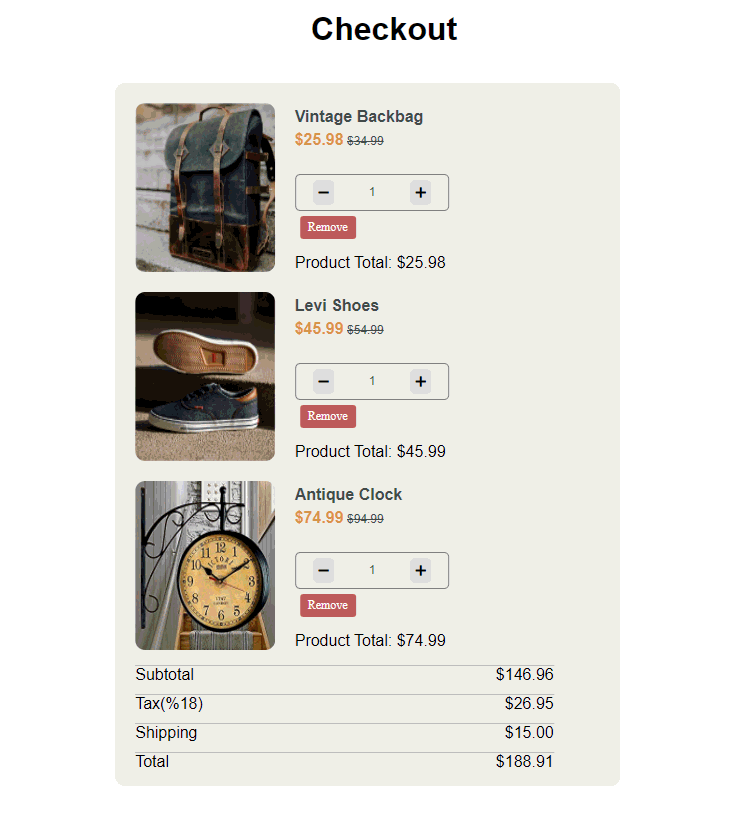

## 👋 Hi there

Hi, I’m **Ümit** 👋  
I’m a **Full-Stack Developer** focused on building web applications with **React** & **Django**.

💻 JavaScript • React • Python • Django • PostgreSQL     
🚀 Focused on building scalable web apps and exploring new technologies.  
✨ A lifelong learner, motivated to grow and excel in the IT industry.  

🌱 Currently learning: Python, JavaScript, React, Django, WordPress, PostgreSQL, Git&GitHub, HTML, CSS, Sass, Bootstrap  
👯 Always open to collaboration on exciting Full-Stack projects  
📫 How to reach me:  

 

## 🌐 Connect with Me  

 

# 💻 Frontend  

### 🚀 Featured Frontend Projects  

| Project  | Tech |Demo Link|Live|
|----------|------|---------|----|
| 🨠SASS Project | HTML, CSS, Sass |[Live Demo](https://umit8098.github.io/Project-Website-HTML-CSS-SASS/)|

|
| 🅱️ Bootstrap-Project | Bootstrap5, HTML, CSS |[Live Demo](https://umit8098.github.io/Project-Bootstrap-Single-Page-Website/) | 

|
| 🛒 Checkout Cart | JavaScript, LocalStorage, SessionStorage |[Live Demo](https://umit8098.github.io/Project-js-checkout-shopping_cart/) | 

|
| ✅ ToDo App | JavaScript, LocalStorage |[Live Demo](https://umit8098.github.io/Project-js-ToDo-LocalStorage/) | 

|
| 📱 iOS Calculator | JavaScript |[Live Demo](https://umit8098.github.io/Project-js-IOS-Calculator/) | 

|
| 🚩 Flag App | JavaScript, API | [Live Demo](https://umit8098.github.io/Project-js-Flag-App/) | 

|
| 🗺️ Tour Places | React, Sass |[Live Demo](https://umit8098.github.io/React_Proj_Tour_Places/) | 

|
| 🗣️ Language Cards | React |[Live Demo](https://umit8098.github.io/React-Project-Language-Cards/) | 

|
| 📚 Tutorial FullStack | React, Django | [Live Demo](https://umit8098.github.io/React-Project-Tutorial-FullStack/) | 

|
| 📋 Task Tracker | React, LocalStorage |[Live Demo](https://umit8098.github.io/React-Project-Task-Tracker-Single-Page/) |  

|

<!--

  

-->
<!---->

 

# ⚙ Backend  

### 🚀 Featured Backend Projects  
| Project | Stack | Demo |Live|
|---------|-------|------|----|
| ✈️ Flight App | Django REST Framework | [Live Demo](https://umit8113.pythonanywhere.com/) |

|
| 📠Blog API | Django REST Framework | [Live Demo](https://umit8114.pythonanywhere.com/) |

|
| 👤 Personnel App | Django REST Framework | [Live Demo](https://umit8100.pythonanywhere.com/) |

|
| ✅ Todo API | Django Rest Framework | [Live Demo](https://umit8101.pythonanywhere.com/) |

|
| 📠Quiz API | Django Rest Framework | [Live Demo](http://umit8102.pythonanywhere.com/) |

|
| 📊 Stock API | Django REST Framework | [Live Demo](https://umit8103.pythonanywhere.com/) |

|
| 🚗 Rent A Car API | Django REST Framework | [Live Demo](https://umit8104.pythonanywhere.com/) |

|
| 🔠Auth_Dj_Allauth_Google API | Django Rest Framework | [Live Demo](https://umit8110.pythonanywhere.com/) |

|Social_Account_Auth_App
| 📠Blog APP | Django Rest, Django_Templates, FullStack | [Live Demo](https://umit8112.pythonanywhere.com/) |

|
| ✅ Todo APP | Django Rest, Django_Templates, FullStack | [Live Demo](https://umit8106.pythonanywhere.com/) |

|
| 🌦️ Weather App | Django Rest, Django Templates, FullStack | [Live Demo](https://umit8108.pythonanywhere.com/) |

|
| 🕠Pizza App | Django Rest, Django Templates, FullStack | [Live Demo](https://umit8111.pythonanywhere.com/) |

|

 

# 🛠 Tools  

 

<!---->

## 📊 GitHub Stats  

&nbsp;
 

  <!-- -->

  

<!--  -->

 

## 🐍 Snake Animation

<!--  -->

<!--
- 🔭 I’m currently working on ...
- 🌱 I’m currently learning Python, SQL, Git&GitHub, HTML,
- 👯 I’m looking to collaborate on ...
- 🤔 I’m looking for help with ...
- 💬 Ask me about ...
- 📫 How to reach me: ...
- 😄 Pronouns: ...
- ⚡ Fun fact: ...
-->

<!-- ### ***Backend Projects*** -->
<!--🔴 ***Flight_App*** .............Django_Rest_Framework....https://umit8113.pythonanywhere.com/      -->
<!--🔴 ***Blog_App*** ...............Django_Rest_Framework....https://umit8099.pythonanywhere.com/        -->
<!--🔴 ***Blog_App***  ...............Django_Templates..............https://umit8112.pythonanywhere.com/   -->
<!--🔴 ***Blog_App V.2*** ........Django_Rest_Framework....https://umit8114.pythonanywhere.com/   -->
<!--🔴 ***Personnel_App*** .....Django_Rest_Framework....https://umit8100.pythonanywhere.com/   -->
<!--🔴 ***Todo_App***  ..............Django_Rest_Framework....https://umit8101.pythonanywhere.com/       -->
<!--🔴 ***Quiz_App*** ...............Django_Rest_Framework....http://umit8102.pythonanywhere.com/         -->
<!--🔴 ***Stock_App*** .............Django_Rest_Framework....https://umit8103.pythonanywhere.com/       -->
<!--🔴 ***Rent_A_Car_App*** ...Django_Rest_Framework....https://umit8104.pythonanywhere.com/   -->
<!--🔴 ***Todo_App*** ..............Django_Templates..............https://umit8106.pythonanywhere.com/            -->
<!--🔴 ***Weather_App*** ........Django_Templates..............https://umit8108.pythonanywhere.com/          -->
<!--🔴 ***Auth_Dj_Allauth_Google*** .....Django_Rest_Framework....https://umit8110.pythonanywhere.com/    -->
<!--🔴 ***Pizza_App***  .............Django_Templates..............https://umit8111.pythonanywhere.com/         -->

<!--

&nbsp;
 

-->

<!--

--> 

